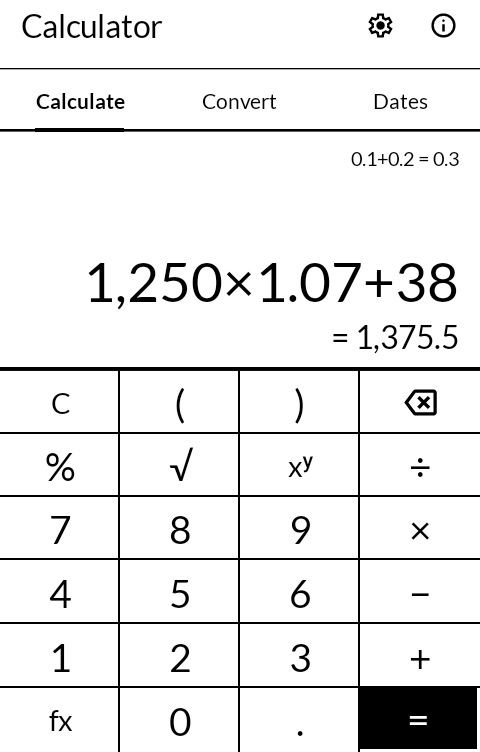
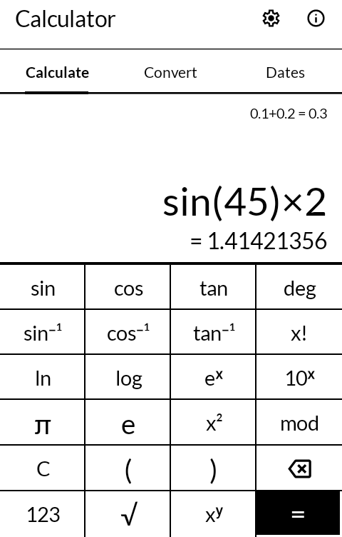
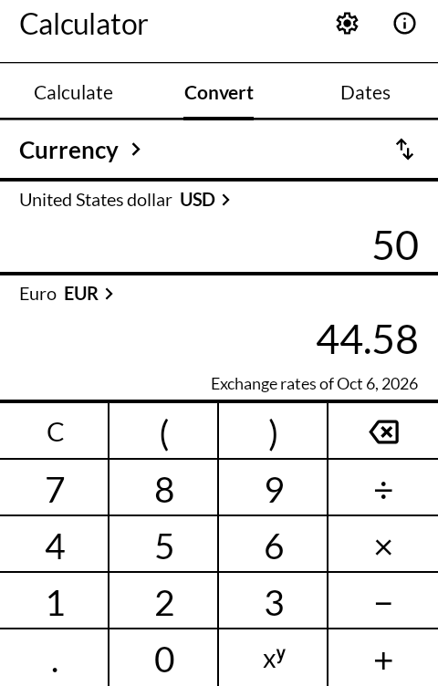
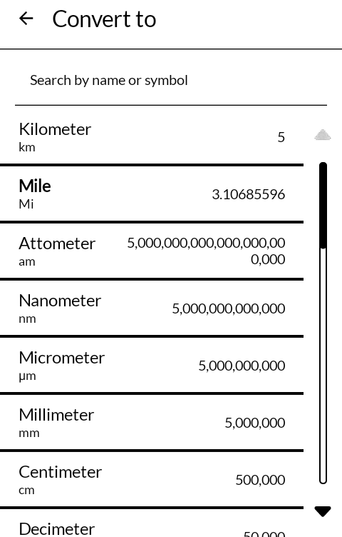

# Calculator

算盤 *soroban*

A calculator, a unit and currency converter, and a date calculator, drawn for an E Ink screen:
big plain keys, a large answer, and nothing that moves.

Built for the [Mudita Kompakt](https://mudita.com/products/kompakt/), whose 4.3" panel has
sixteen greys, a slow redraw, and is read outdoors as often as indoors.

## Screenshots

| | | | |
|---|---|---|---|
|  |  |  |  |

## What it does

- **Calculate.** Type a whole sum, brackets and all; the answer so far shows under it as you go,
  and = puts it in the sum's place to carry on from. An operator after = carries on from the
  answer; a digit or a function starts afresh. Where the answer is a simple fraction it is
  shown as one too, 0.375 as 3⁄8. The arithmetic is done in decimal rather than in binary
  floating point, so 0.1 + 0.2 is 0.3, and an answer is rounded only at the end, to the decimal
  places set.
- **Functions** are a second page of the same keys, behind **fx**: sin, cos and tan and their
  inverses, ln, log, eˣ, 10ˣ, square and any power, roots, factorial, modulo, π and e, and the
  switch between degrees and radians. A function goes into the sum and turns the page back, so
  sin 30 is fx, sin, 3, 0. The keys stay the size they are rather than shrinking to fit both
  pages on one screen.
- **The tape.** The last sum worked out sits above the one being typed; press it for the last
  hundred, newest first, and press any of them to carry on from its answer.
- **Convert** between 24 kinds of unit: length, currency, mass, speed, temperature, area, time,
  volume, data, pressure, acceleration, energy, power, angle, data transfer, flux, number base,
  capacitance, prefix, force, torque, flow rate, luminance and fuel consumption. Press either
  unit for the list of its kind, with a search by name or symbol; the list to convert *to* shows
  what the number comes to in every unit, so it is an answer in itself. What is typed can be a
  sum too. Feet come out as feet and inches, pounds as pounds and ounces, and a length of time
  also in days, hours and minutes.
- **Number bases** from binary to hexadecimal, with only the digits the base has on the keypad.
- **Dates**: how long between two days, in years, months and days and in days and weeks; or
  which day it is so many years, months and days on from another, or back.
- **Hold** the sum or a value to copy it, share it as text, or paste a number in its place.
- **Settings**: decimal places, how numbers are written (1,234.5 or 1.234,5 and the spaced
  forms; it starts as the phone's language has it), every digit or E for very large and small
  numbers, and the fraction on or off.

## Currency

Exchange rates come from [Fawaz Ahmed's currency API](https://github.com/fawazahmed0/exchange-api),
which publishes one file a day of over 200 currencies, metals and coins. They are fetched only
while currency is open in the converter, at most once a day, and kept on the phone: with no
signal the converter uses the last rates it has and says which day they are from. A phone that
has never been online has no rates at all, and says that instead. Amounts are shown to the cent
(a coin worth less, to its first figure), whatever the decimal places are set to. They are a
day's reference rates, not what a bank or a card will charge.

## What it does not do

No graphing, and no programmer's calculator with bit operations and word sizes, yet. No time
zones or body mass, which Unitto has. No widgets, history across phones, or themes: it is black
on white.

## Building

```
./gradlew assembleRelease
```

A release is signed by a keystore in `signing/`, which is not in this repository. Without
it the release APK builds **unsigned** and will not install anywhere — there is no
fallback key by design.

## Getting it, and keeping it

Download <https://github.com/wanderwildwood/soroban/releases/latest/download/soroban.apk>
and sideload it. That address always points at the newest release, and every release
publishes a `.sha256` beside the APK.

For updates without doing this by hand, add this repository to
[Obtainium](https://github.com/ImranR98/Obtainium):

    https://github.com/wanderwildwood/soroban

## Credit

A fork of [Unitto](https://github.com/sadellie/unitto) by Elshan Agaev, GNU General Public
License v3 or later, whose history this repository keeps. The expression evaluator, the
arbitrary-precision arithmetic, the number formatting, every unit and conversion, the
calculator's editing rules and fraction finder, and their tests are Unitto's, under
`app/src/main/kotlin/com/sadellie` and `io/github/sadellie`. The screens are written fresh in
Jetpack Compose against [MMD](https://github.com/mudita/MMD), Mudita's E Ink component library.
Unitto's name, icon and look are not used, as its README asks.

Arithmetic beyond + − × ÷ is [big-math](https://github.com/eobermuhlner/big-math), MIT. Icons
are [Material Symbols](https://fonts.google.com/icons), Apache License 2.0.

## Licence

GPL-3.0-only for what is written here. See [LICENSE](LICENSE). Unitto's own files keep the
licence they came under, GPL-3.0-or-later.

Copyright (C) 2026 wander wildwood

This program is free software: you can redistribute it and/or modify it under the terms of the
GNU General Public License as published by the Free Software Foundation, version 3.

This program is distributed in the hope that it will be useful, but WITHOUT ANY WARRANTY;
without even the implied warranty of MERCHANTABILITY or FITNESS FOR A PARTICULAR PURPOSE. See
the GNU General Public License for more details.

You should have received a copy of the GNU General Public License along with this program. If
not, see <https://www.gnu.org/licenses/>.
